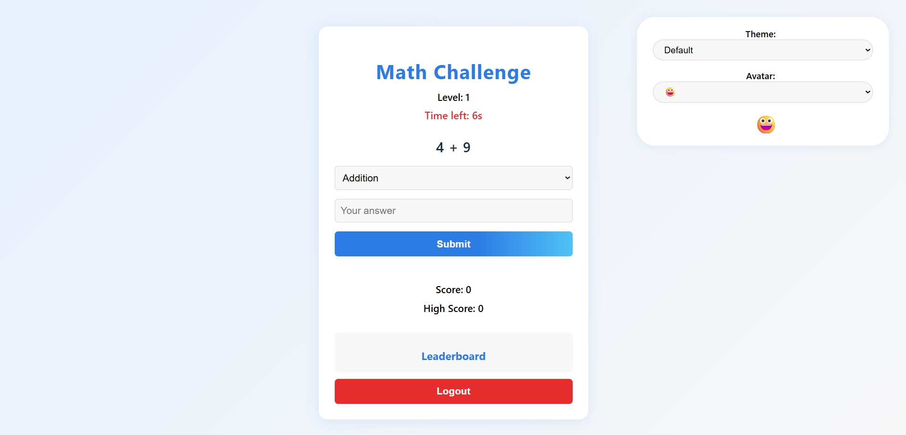
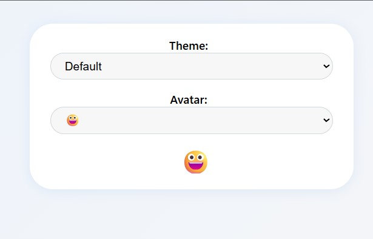

# Math Challenge Mini-Game

A joyful, modern web app for practicing math skills, built for the GitHub Hackathon 2025!

## 💡 Motivation
Math Challenge Mini-Game was created to make learning and practicing math fun for everyone. Inspired by classic arcade games, it combines adaptive difficulty, achievements, and daily challenges to keep users engaged and delighted. Built for the #ForTheLoveOfCode hackathon, this project aims to bring joy and surprise to math practice!

## 🚀 Features
- User authentication (login/signup)
- Adaptive difficulty and levels
- Timer for each question
- Multiple question types (addition, subtraction, multiplication, division, power, fraction)
- Sound effects and animations
- Leaderboard and high score tracking
- Achievements and badges
- Daily challenge mode
- Customization: themes and avatars
- Mobile-friendly, responsive design

## 📸 Demo



*Or add a GIF:*


## 🛠️ Technologies Used
- HTML5
- CSS3 (modern, responsive)
- JavaScript (vanilla)
- LocalStorage for persistence
- GitHub Copilot (for creative coding and rapid prototyping)

## 🏁 Getting Started
1. Clone this repo:
   ```sh
   git clone https://github.com/prabasajee/Math-Challenge-Mini-Game.git
   ```
2. Open `index.html` in your browser (double-click or drag into browser).

No build steps required—just open and play!

## 🤝 Contributing
Pull requests are welcome! For major changes, please open an issue first to discuss what you would like to change.

### Hackathon Topic
This project is tagged with `#ForTheLoveOfCode` for the GitHub Summer Hackathon 2025.

## 📄 License
MIT License

## 🙏 Credits
- Created by prabasajee for the GitHub Hackathon 2025
- Special thanks to all contributors, testers, and GitHub Copilot for creative coding support

---
Enjoy challenging your math skills and climbing the leaderboard!
